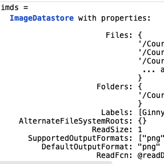
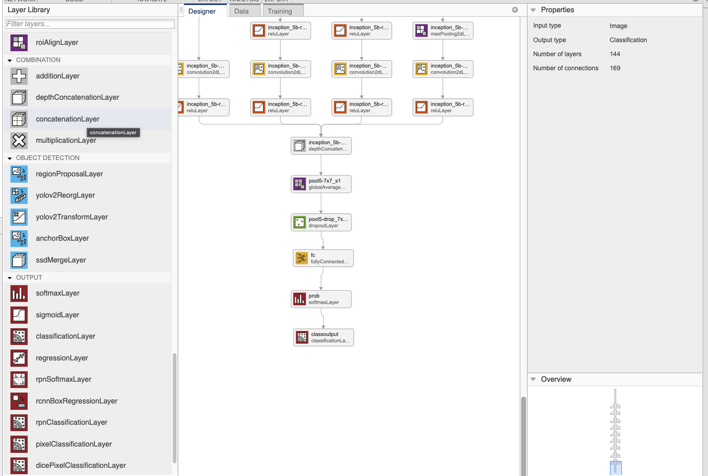
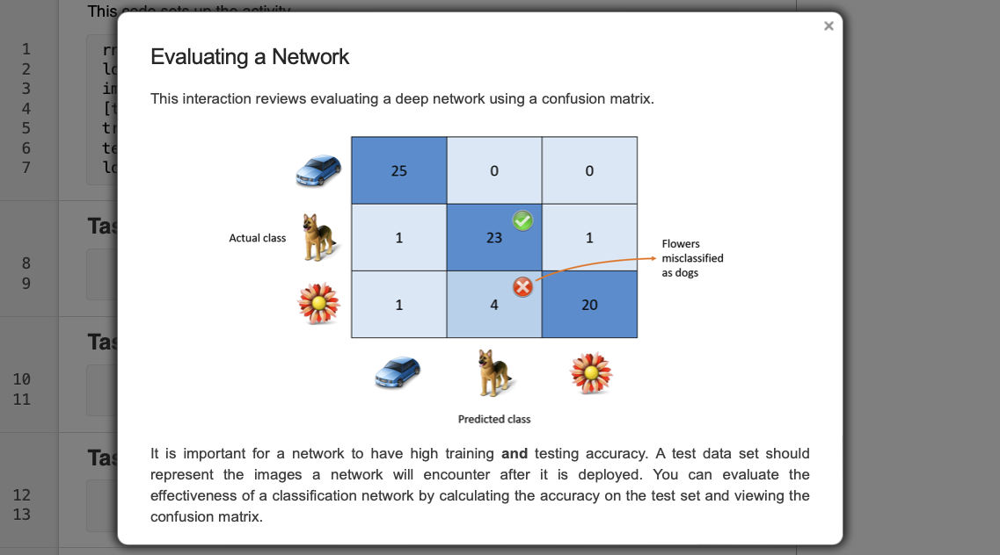

# neural-network
 
## Dataset

`montage(datastore) ` così da mostrare insieme tutte le immagini

`auds = augmentedImageDatastore([224 224],imds)`ridimensiona le immagini per essere accettare dalla rete 
---
Proprietà del `datastore`:

---

During training, the network learns to associate the training images and labels. The network may have a high training accuracy, but a network is only useful if it can generalize to new images. You should use a separate test data set to evaluate if the network can classify images it has not yet seen.

You can split the data set with splitEachLabel.
`[ds1,ds2] = splitEachLabel(imds,p)`
The proportion p (a value from 0 to 1) indicates the proportion of images from each label from imds that are contained in ds1. The remaining files are assigned to ds2.

--- 

Algorithm options control how a network is trained. You can create these options with the trainingOptions function.

`opts = trainingOptions(algorithm,..."InitialLearnRate",rate)`

The first input is the name of the training algorithm to use. A common modification from the default options is to decrease the initial learning rate.

There are many other options you can set. To see the possible training algorithms and other options, refer to the documentation.

[trainingOptions](https://it.mathworks.com/help/deeplearning/ref/trainingoptions.html)

Varia i layer:

ùù

## Valutazione della rete

`confusionchart(testImgs.Labels,testPreds)`

## References

- https://it.mathworks.com/help/vision/ug/semantic-segmentation-using-deep-learning.html 
- https://it.mathworks.com/help/deeplearning/ref/resnet50.html;jsessionid=099728639a3522d8e9c3a9a1d977 